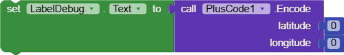
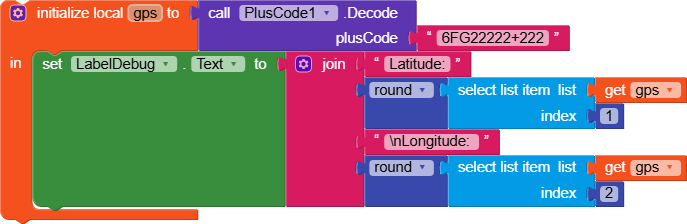

# Plus Codes AppInventor Extension
An MIT App Inventor 2 extension to convert between [Google Plus Codes](https://maps.google.com/pluscodes/) and GPS latitude and longitude positions.

## Usage

The code relies on the java library openlocationcode, which is compiled from this [repository](https://github.com/google/open-location-code/tree/main/java). 

Created by: Michael Frey

Compiled by: FAST
